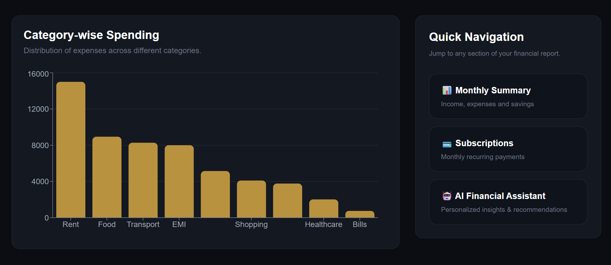
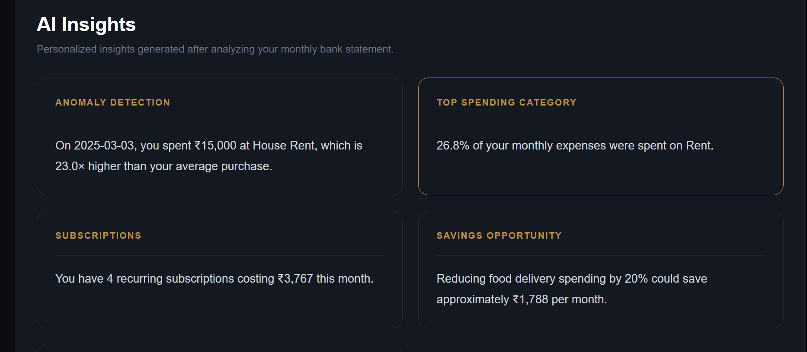

# 💰 AI Expense Analyzer

An AI-powered personal finance dashboard that analyzes bank statement CSV files to help users understand their spending habits. The application automatically categorizes expenses, detects recurring subscriptions, predicts next month's spending, and generates meaningful financial insights through an interactive dashboard.

Designed with a clean React interface and powered by a FastAPI backend, the project demonstrates data analysis, visualization, and predictive analytics in a real-world finance use case.

---

# 🌐 Live Demo

### Frontend
https://ai-expense-analyzer-mu.vercel.app/

### Backend API
https://ai-expense-analyzer-yhwp.onrender.com

---

# ✨ Features

-  Upload bank statement CSV files
-  Interactive expense dashboard
-  Automatic expense categorization
-  Total, average and highest expense analysis
-  Category-wise spending visualization
-  Subscription detection
-  AI-generated financial insights
-  Next month expense prediction
-  Interactive charts for expense analysis
-  Clean and responsive user interface

---

# Tech Stack

### Frontend
- React.js
- Tailwind CSS
- Axios
- Recharts

### Backend
- FastAPI
- Python
- Pandas

### Machine Learning
- Scikit-learn
- Predictive Expense Analysis

### Deployment
- Vercel
- Render

### Version Control
- Git
- GitHub

---

# 🤖 Machine Learning Used

The project includes a predictive analytics module that estimates the user's next month's expenses based on their current spending pattern. Although the current implementation uses a simple prediction strategy for demonstration purposes, the architecture is designed to be easily extended with machine learning models such as Linear Regression, Random Forest, or XGBoost using historical multi-month transaction data.

---

# 📂 Sample Dataset

You can test the application using the sample bank statement provided below.

📄 **Sample CSV**

> *([Download Sample Bank Statement](data/bank_statement.csv))*

---

# Future Improvements

- Support PDF bank statement uploads using OCR
- Multi-month expense trend analysis
- Budget planning and savings goals
- User authentication and cloud storage
- Advanced ML models for expense forecasting
- Personalized financial recommendations using LLMs

---

# 📸 Screenshots

## Home Page

---

## Expense Dashboard

---

## Expense Analysis

---

## AI Insights

