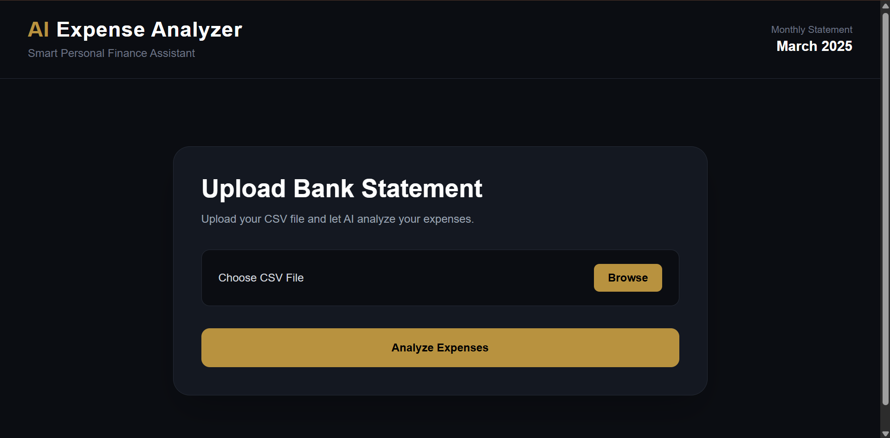
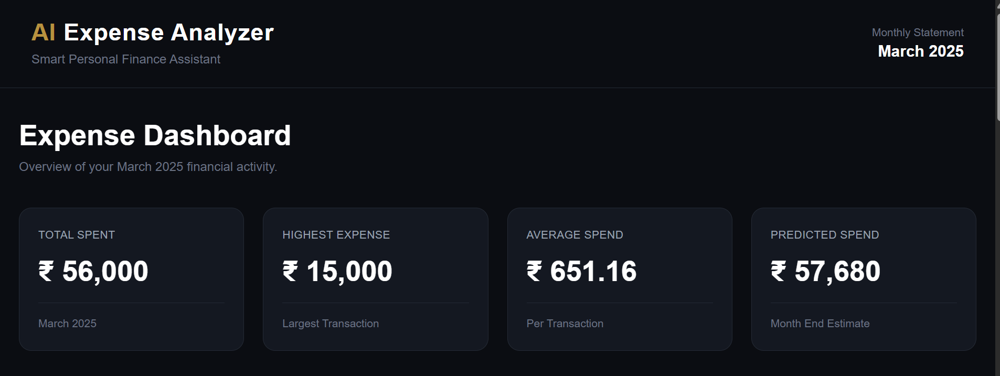

# 💰 AI Expense Analyzer

An AI-powered personal finance dashboard that analyzes bank statement CSV files, categorizes expenses, detects subscriptions, predicts next month's spending, and generates personalized financial insights.

---

## 🚀 Live Demo

**Frontend:** *(Add Vercel URL after deployment)*

**Backend API:** *(Add Render URL after deployment)*

---

## 📸 Screenshots

### Upload Page


### Expense Dashboard


### Expense Chart


### AI Insights


---

## ✨ Features

- 📂 Upload bank statement CSV files
- 📊 Interactive expense dashboard
- 🏷 Automatic expense categorization
- 💳 Subscription detection
- 📈 Category-wise spending analysis
- 🤖 AI-generated financial insights
- 🔮 Next month expense prediction
- 💰 Total, average, and highest expense analysis

---

## 🛠 Tech Stack

### Frontend
- React.js
- Tailwind CSS
- Axios
- Recharts

### Backend
- FastAPI
- Python
- Pandas
- Scikit-learn

### Tools
- Git
- GitHub
- Vercel
- Render

---

## 📁 Project Structure

```
AI-Expense-Analyzer
│
├── backend/          # FastAPI backend
├── frontend/         # React frontend
├── images/           # README screenshots
├── ml_data/          # Sample ML data
├── src/              # Analysis modules
├── README.md
└── .gitignore
```

---

## ⚙️ Installation

### Clone Repository

```bash
git clone https://github.com/priya250805/AI-Expense-Analyzer.git
```

### Backend

```bash
cd backend

python -m venv .venv

# Windows
.venv\Scripts\activate

pip install -r requirements.txt

python -m uvicorn main:app --reload
```

Backend runs on:

```
http://127.0.0.1:8000
```

---

### Frontend

```bash
cd frontend

npm install

npm run dev
```

Frontend runs on:

```
http://localhost:5173
```

---

## 📂 Sample Dataset

Upload any bank statement CSV following this format:

| Date | Merchant | Category | Amount | Transaction Type |
|------|----------|----------|--------|------------------|
| 2025-03-01 | Zomato | Food | 450 | Debit |

---

## 📈 AI Insights Generated

The application provides:

- Largest transaction detection
- Top spending category
- Subscription summary
- Savings recommendations
- Monthly spending prediction

---

## 🔮 Future Improvements

- Multi-month spending trends
- OCR support for PDF bank statements
- Budget goal tracking
- User authentication
- Personalized financial recommendations using LLMs

---

## 👩‍💻 Author

**Priya Wandhekar**

GitHub: https://github.com/priya250805

---

## ⭐ Support

If you found this project useful, consider giving it a ⭐ on GitHub.